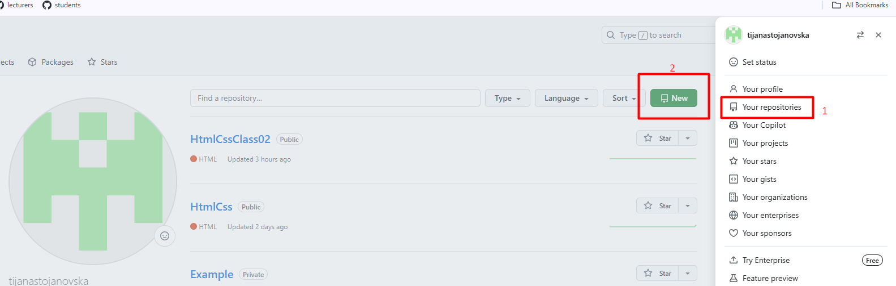
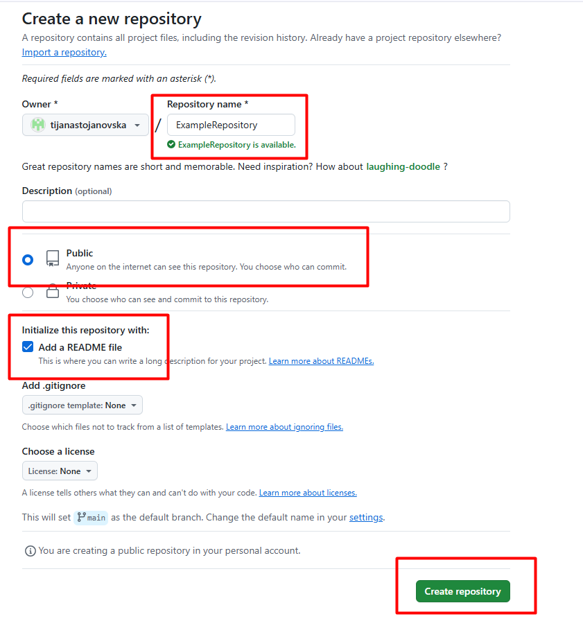
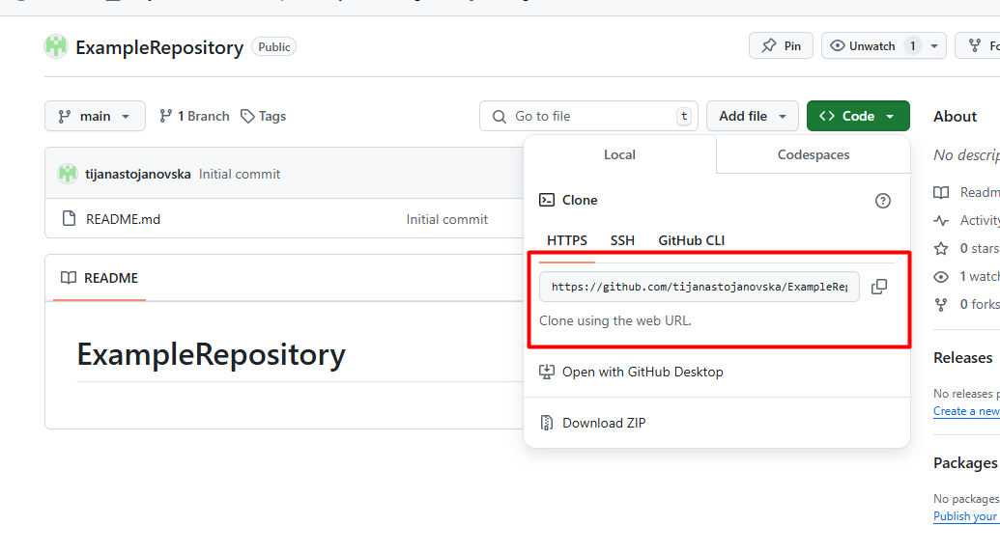
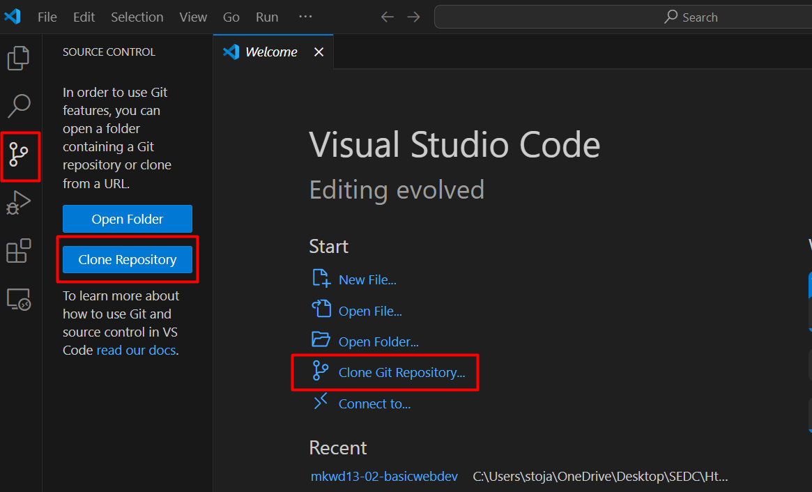
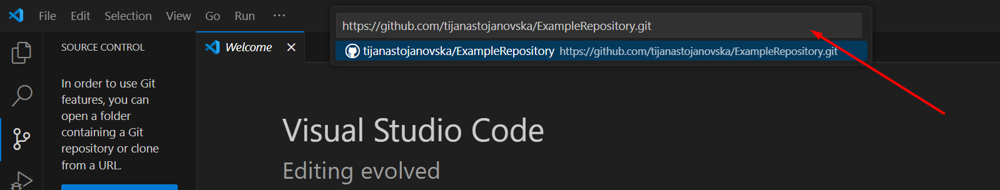
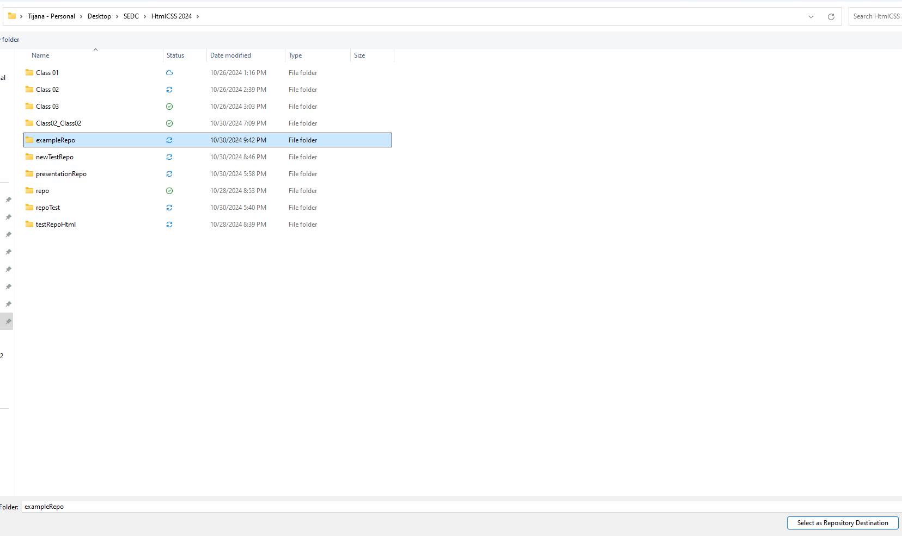
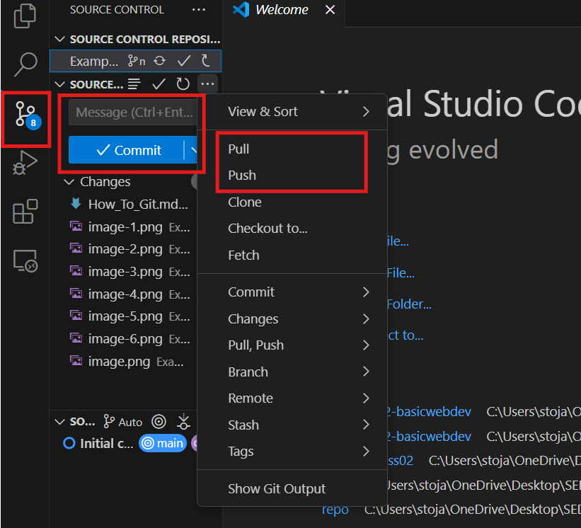

# Intro to git

## How to create your own repository
 ### 1. Download git at https://git-scm.com/downloads
 ### 2. Create your account at https://github.com/
 ### 3. Create your own repository
  
  
 ### 4. Copy the link to clone the repository
  
 ### 5. Open VS Code and click on the clone a repository 
   - you can do this in the welcome file or in the source control menu
   (At first you will have an option to connect to your git account)
   
   
 ### 6. Paste the link that you copied to clone the repository
   
 ### 7. Choose a local destination where you would like to clone the repository
   
 ### 8. You can see the changes in the source control menu. Create a commit and then use the pull and push commands
  
